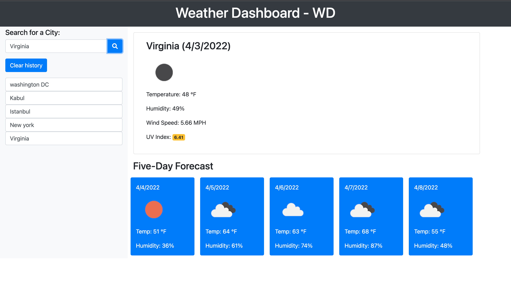

# Weather-Dashboard - WD

## About me
I am GW coding student, looking to solve problems, I have a passion for learning  and sharing my knowlege with other as publicaly as possible, if you found value in something I have created, please feel free to give me a shout out @Tariqstanikizai, fell free to reach out in case you want to just get in touch also.

## Purpose of WD:
WD A simple web application that allows users to search for a city to get the current weather and 5 day forecast. Cities that users previously looked up will be saved in their local storage.

## WDS Features :
Using a daily planner to create a schedule.
The current day and Date are displayed at the top of the calendar.
Each time block is color-coded to indicate whether it is in the past, present, or future.
Text for event is saved in local storage.

## Technology in Used :
* HTML
* Bootstrap
* JAVA SCRIPT
* OpenWeather API

## The following image demonstrates the application functionality:

## Usage:
This should only be used as an exploration or educational project.
Allows users to search for a city to get the current weather and 5 day forecast.
It will display the the city name, the date, an icon representation of weather conditions, the temperature, the humidity, the wind speed, and the UV index.
Search history will be saved in local storage.

## Links:

* The URL of the deployed application.

* The URL of the GitHub repository.
 https://github.com/Tariqstanikzai/Weather-Dashboard-WD 

## Contact
 * @tariq_stanikzai
